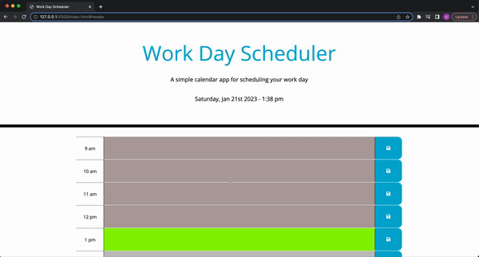

# Work Day Scheduler

## Description

This is a simple calendar application that allows the user to save events for each hour of the 9am-5pm working day. This app runs in the browser and features dynamically updated HTML and CSS powered by jQuery. 
 
This Application:

* Displays the current day and time at the top of the calender.
 
* Presents timeblocks for standard business hours when the user scrolls down.
 
* Color codes each timeblock based on past, present, and future when the timeblock is viewed.
 
* Allows the user to enter an event when they click a timeblock.

* Saves the event in local storage when the save button is clicked in that timeblock.

* Keeps event in timeblock when page is refreshed.

* Has a button at the bottom of the page which scrolls back to the top of the page once clicked. 
 

## Mock-Up

The following animation demonstrates the application functionality: 
 

 
 

## Deployed Application Link

https://dre86dre.github.io/work-day-scheduler/ 
 

## License
Licensed under the MIT license.